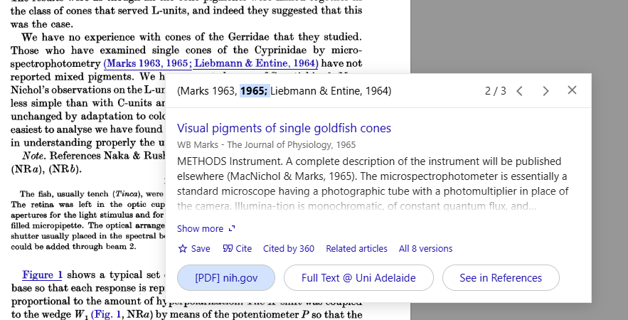

## Citation Chasing

- [Research Rabbit](www.researchrabbit.ai) has a great Zotero integration and can help find papers with a nice graphical interface:

- [Citation Gecko](https://citationgecko.azurewebsites.net/) has a similar vibe but works in slightly different circumstances

- [Google Scholar PDF Reader](https://chromewebstore.google.com/detail/google-scholar-pdf-reader/dahenjhkoodjbpjheillcadbppiidmhp) plugin for Chrome/Chromium browsers finds references in PDFs (even ancient ones) quickly. Here's one from @naka_spotentials_1966:

If you're interested in how these and similar tools work, where they draw their resources from and how transparent they are, this article gives a good overview:

- [All About Citation Chasing and Tools](https://musingsaboutlibrarianship.blogspot.com/2024/06/all-about-citation-chasing-and-tools.html)

## Bibliography Writing:

- [Zotero](https://www.zotero.org/download)
	- [ZotMoov](https://github.com/wileyyugioh/zotmoov/releases) 
		- Automatically move attachments into a designated folder (e.g., cloud storage)
	- [BetterBibtex](https://github.com/retorquere/zotero-better-bibtex/releases)
		- Gives elements in your Zotero library customisable, unique, human readable keys. 
		- Built to help create bibliographies for $\LaTeX$ or pandoc/markdown/rmarkdown/quarto workflows
		- Necessary for Obsidian integration

- [zbib](https://zbib.org/) lets you make formatted bibliographies quickly

## Reproducible workflows

- [Quarto](https://quarto.org/)
	- Markdown format that allows for code chunks that are able to output data from R and Python (e.g., insert values and figures into text)
	- Created Posit by the team that makes [RStudio](https://posit.co/download/rstudio-desktop/)
	- Useful for writing academic documents and distributing them to different formats
		- You're able to make a webpage or Word document or pdf out of the same file
	- Similar to [RMarkdown](https://rmarkdown.rstudio.com/) but with better support^[$\LaTeX$-like] for figures, tables, contents, citations etc.
	- Built from [Pandoc](https://pandoc.org/)
	- Templates are available for journals from a few publishers:
		- https://quarto.org/docs/journals/
	- Documents are editable (though not really renderable (yet)) in Obsidian
- [Positron](https://positron.posit.co/)
	- Code editor (alternative to [RStudio](https://posit.co/download/rstudio-desktop/) with more extensibility, more Python support but slightly worse R support)
	- A version of [VSCode](https://code.visualstudio.com/) that is optimised for working in R or Python
	- Still early in development (a bit buggy)
